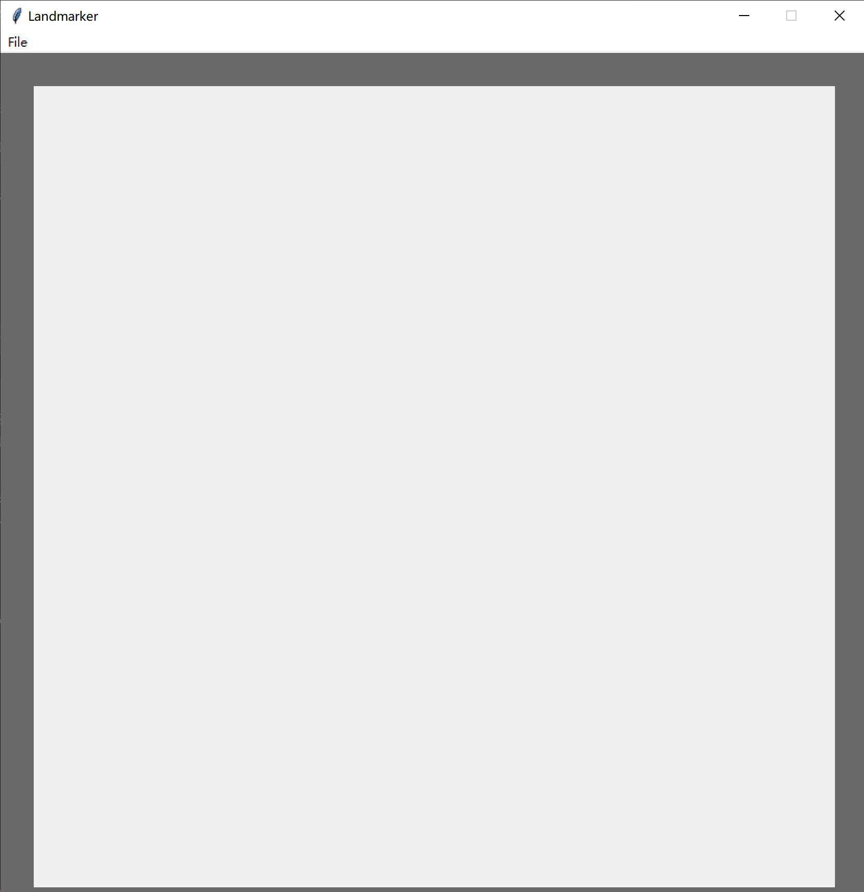
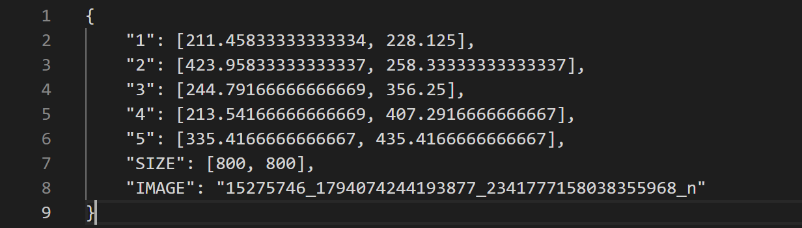
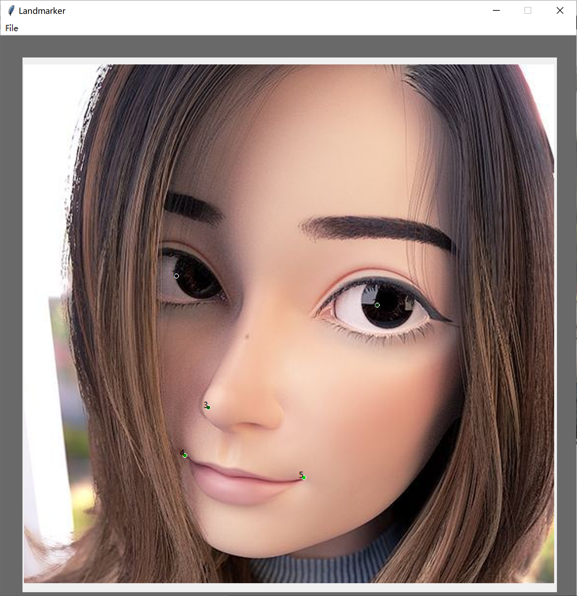
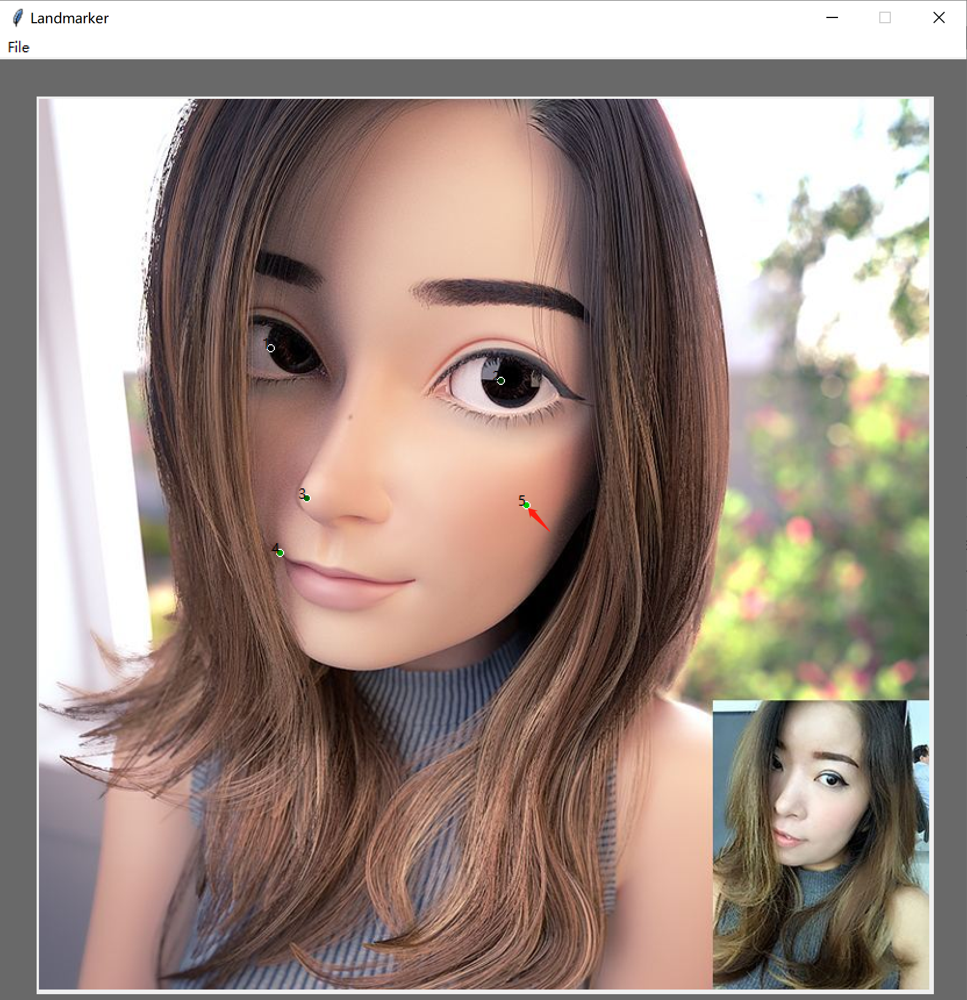
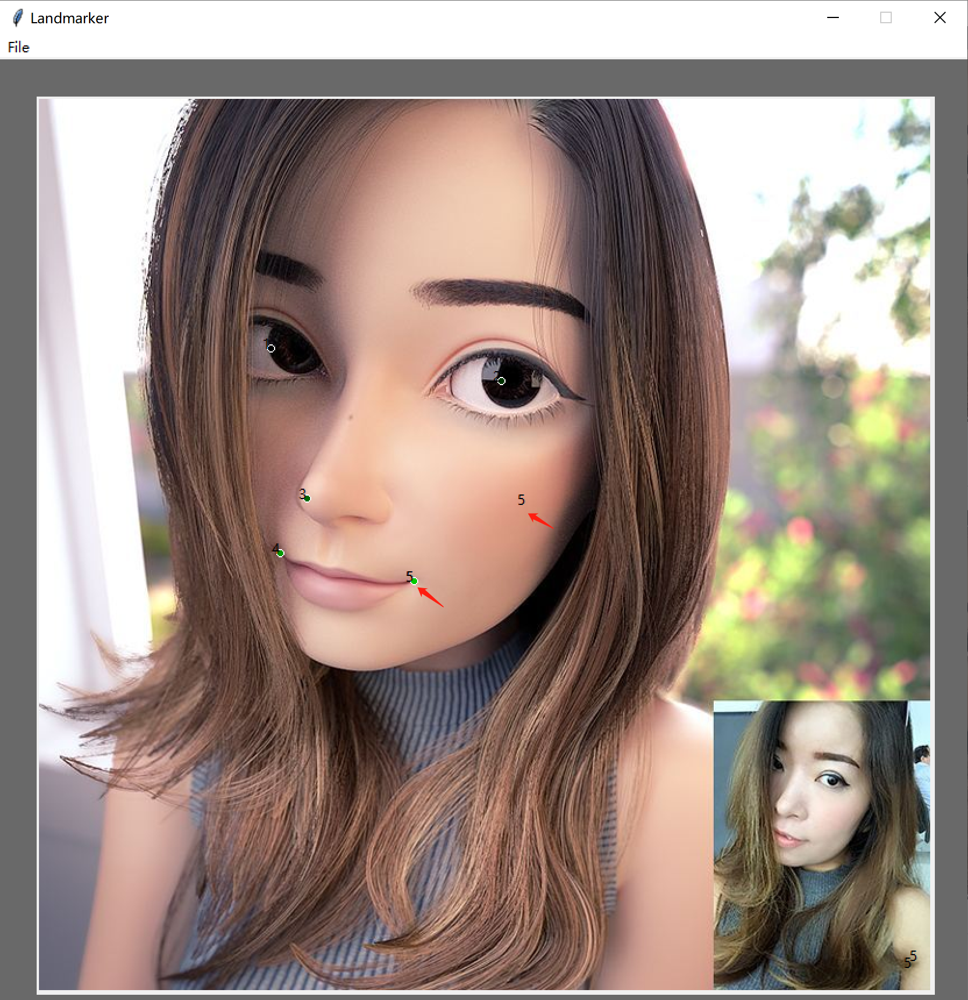
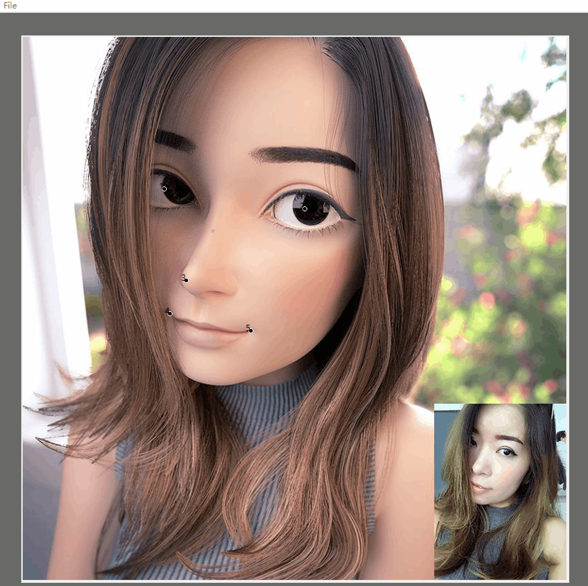

# Label Any Landmarks
Some interesting GUI tools built via `TKinter-python`.

一些有意思的用 `TKinter-python` 实现的工具。可以当做大作业的实例学习，也可以直接使用哈哈。

### 1️⃣ Landmarks/Key-points Annotation :fire::fire:

Before beginning, **modify** the maximum number of landmarks w.r.t. your scenario in line#49 in `./interface_landmarks_annotator.py` (**5** by default).

```python
#####################################################
#  Modify the following line w.r.t. your scenario.  #
#####################################################
window.max_count_landmarks = 5
#####################################################
```

**Running** by `python ./interface_landmarks_annotator.py`, and we will see



TO START

| 1️⃣ Open the image directory         | 2️⃣ Open the landmarks directory                               | 3️⃣  Annotate                        | 4️⃣ Save                                                       |
| ---------------------------------- | ------------------------------------------------------------ | ---------------------------------- | ------------------------------------------------------------ |
| [File]-[打开文件夹]                | [File]-[打开保存文件夹]                                      | **Left click** the mouse ​🖱️​.        | Click the :arrow_left: or :arrow_right: to save the current annotation and <br/>go to the **previous** or the **next** image. |
|  | p.s. If there exists `.txt` file with the same name, <br/>e.g., `{image-filename}-0.txt`, it will be loaded and displayed. |  |  |

MORE useful applications.

| 5️⃣ Zoom Out                                                   | 6️⃣ De-annotate                                                | :seven: Multiple Subjects                                    |
| ------------------------------------------------------------ | ------------------------------------------------------------ | ------------------------------------------------------------ |
| 1. Single Click the white space<br/>2. [Left Click] & [Drag] & [Release] to draw a **rectangle** region to zoom out.<br/><br/>3. Click 🖱️ to annotate.<br/><br/>4. Click :arrow_left: and turn to the original view.<br/><br/>5. Save. | 1. Move 🖱️ to be as close as possible to the target point to re-annotate.<br/><br/>2. [**Right** Click] to remove the original annotation.<br/><br/>3. [Left Click] to re-annotate the point.<br/><br/>4. Save. | 1. Notice that the naming format of the resulted `.txt`'s<br/>2. Suppose we have annotated the first subject<br/><br/>3. Click :arrow_down:, the first annotation will be hided (& saved)<br/>4. Click 🖱️ to annotate a second subject.<br/><br/>5. Save.<br/>6. Click :arrow_up: or :arrow_down: to view multiple annotations for different subjects.<br/> |

